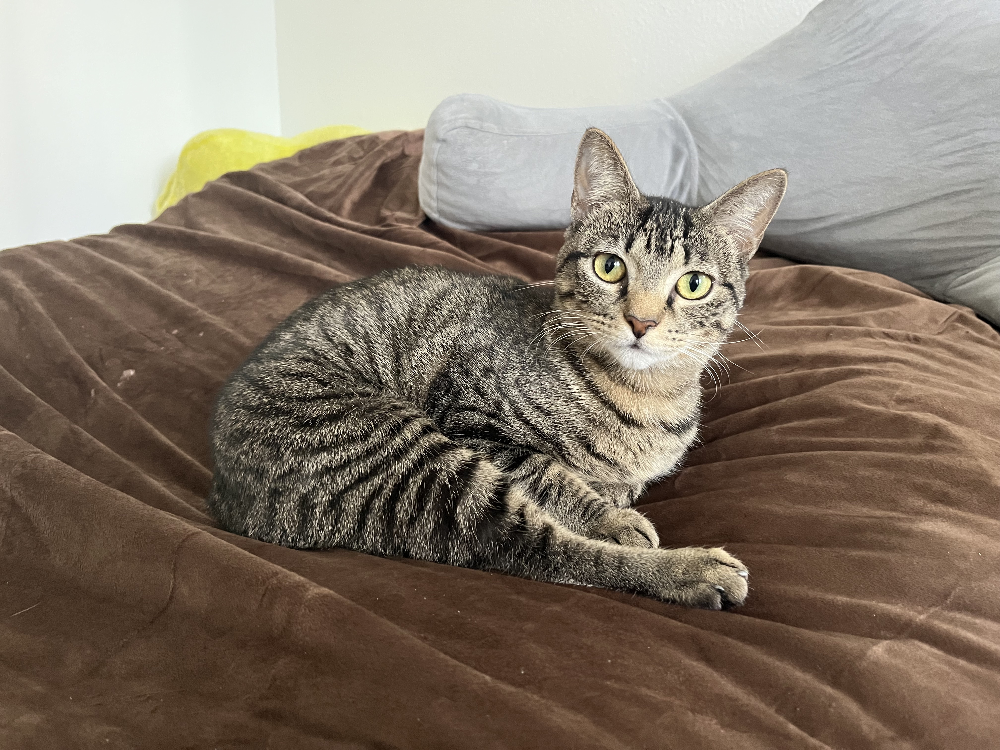
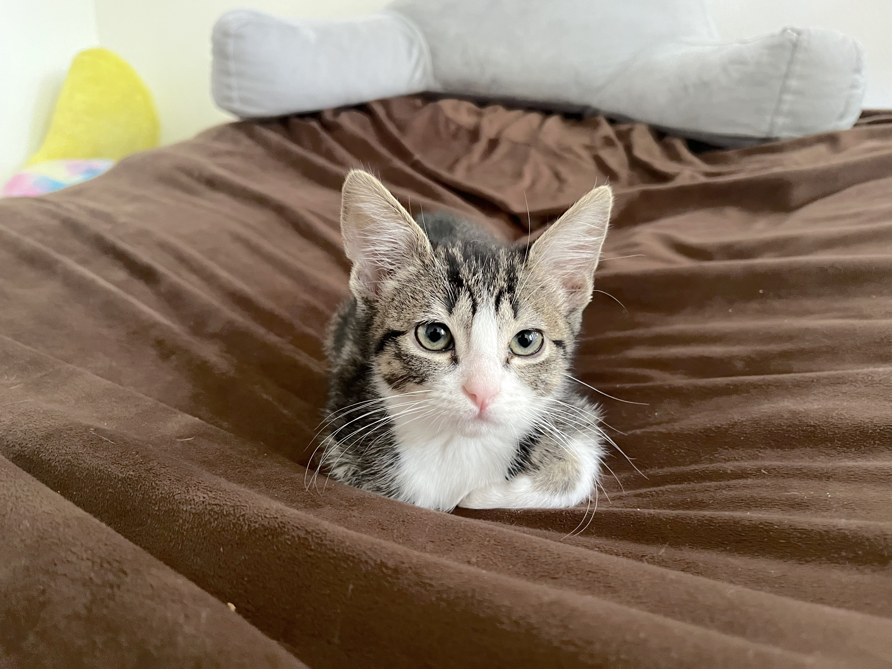

  

    

      
    

    

      
My favourite instrument is the ukulele, my lockdown hobby turned lifelong love. I play a Kanile'a KSR-T Deluxe tenor. You can find some of my tabs below. MuseScore files available upon request.

      
      
<a href="../assets/tabs/Blue_Roses_Falling.pdf" target="_blank">Blue Roses Falling</a> by Jake Shimabukuro

      
      
<a href="../assets/tabs/Onara.pdf" target="_blank">오나라 (Onara)</a> from 대장금 (Dae Jang Geum) OST

      
      
<a href="../assets/tabs/茉莉花.pdf" target="_blank">茉莉花 (Jasmine Flower)</a>, a Chinese folk song

      
      
<a href="../assets/tabs/Auld_Lang_Syne.pdf" target="_blank">Auld Lang Syne</a>, a Scottish folk song

      
      
<a href="../assets/tabs/Cello_Suite_No_1_Prelude.pdf" target="_blank">Cello Suite No. 1 Prélude</a> by J.S. Bach

    

  

    
  

    

      
    

    

      This is my big cat, Zoisa, adopted on January 28, 2023.
    

  

  
  

    

      
    

    

      This is my little cat, Dani, adopted on April 18, 2023.
    

  

