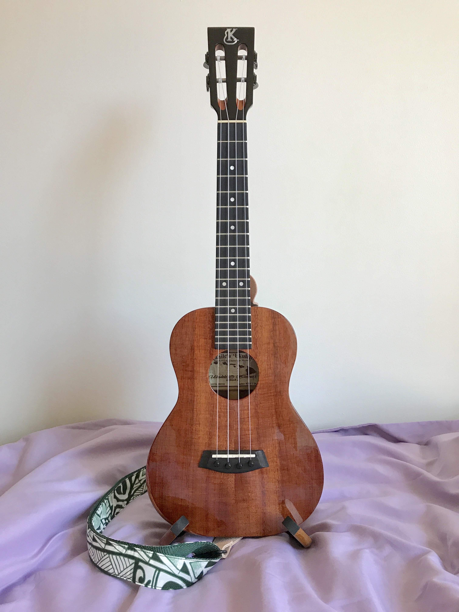

  

    

      
    

    

      
My favourite instrument is the ʻukulele, my lockdown hobby turned lifelong love. I play a Kanileʻa KSR-T Deluxe tenor. You can find some of my tabs below.

      
<a href="../assets/music/Arirang.pdf" target="_blank">아리랑 (Arirang)</a>, a Korean folk song

      
<a href="../assets/music/Onara.pdf" target="_blank">오나라 (Onara)</a> from 대장금 (Dae Jang Geum) OST

      
<a href="../assets/music/Jasmine_Flower.pdf" target="_blank">茉莉花 (Jasmine Flower)</a>, a Chinese folk song

      
<a href="../assets/music/Auld_Lang_Syne.pdf" target="_blank">Auld Lang Syne</a>, a Scottish folk song <a href="https://www.instagram.com/p/Cty2Ps2rEMO/" target="_blank"><i class="fas fa-external-link-alt"></i></a>

      
<a href="../assets/music/Blue_Roses_Falling.pdf" target="_blank">Blue Roses Falling</a> by Jake Shimabukuro <a href="https://www.youtube.com/watch?v=fzvFqVZvDV8" target="_blank"><i class="fas fa-external-link-alt"></i></a>

      
<a href="../assets/music/Blumenkranz.pdf" target="_blank">Blumenkranz</a> from Kill La Kill OST <a href="https://youtu.be/2M-CiPkU2JU" target="_blank"><i class="fas fa-external-link-alt"></i></a>

      
<a href="../assets/music/Cello_Suite_No_1_Prelude.pdf" target="_blank">Cello Suite No. 1 Prélude</a> by J.S. Bach

      
<a href="../assets/music/Inferno.pdf" target="_blank">Inferno</a> from Promare OST

      
<a href="../assets/music/Inferno_(v2).pdf" target="_blank">Inferno (v2)</a> from Promare OST

      
<a href="../assets/music/In_My_Life.pdf" target="_blank">In My Life</a> by The Beatles <a href="https://youtu.be/0kjNS91o1E4?feature=shared&t=1724" target="_blank"><i class="fas fa-external-link-alt"></i></a>

      
<a href="../assets/music/MEGALOBOX_(Acoustic).pdf" target="_blank">MEGALOBOX (Acoustic)</a> from MEGALOBOX OST <a href="https://youtu.be/EbbYiBJqyPU" target="_blank"><i class="fas fa-external-link-alt"></i></a>

      
<a href="../assets/music/No_Ordinary_Girl.pdf" target="_blank">No Ordinary Girl</a> from H2O: Just Add Water OST <a href="https://youtu.be/bfkm9qLmin0" target="_blank"><i class="fas fa-external-link-alt"></i></a>

      
<a href="../assets/music/Reflection.pdf" target="_blank">Reflection</a> from Mulan OST

      
<a href="../assets/music/Short_Hair.pdf" target="_blank">Short Hair</a> from Mulan OST <a href="https://youtu.be/Po1aShL07iY" target="_blank"><i class="fas fa-external-link-alt"></i></a>

      
<a href="../assets/music/Something.pdf" target="_blank">Something</a> by George Harrison <a href="https://www.youtube.com/watch?v=naJlZujI2Ps" target="_blank"><i class="fas fa-external-link-alt"></i></a>

      
      
<a href="../assets/music/Yellow_Bird.pdf" target="_blank">Yellow Bird</a> by Michel Mauléart Monton

      
<a href="../assets/music/You_and_I.pdf" target="_blank">You and I</a> by Park Bom

      
And some piano too.

      
<a href="../assets/music/piano_If_You_Love_Me_For_Me.pdf" target="_blank">If You Love Me For Me</a> from Barbie as the Princess and the Pauper OST <a href="https://www.youtube.com/watch?v=SMe10v_rRbo" target="_blank"><i class="fas fa-external-link-alt"></i></a>

      
<a href="../assets/music/piano_Inferno.pdf" target="_blank">Inferno</a> from Promare OST <a href="https://youtu.be/-eRd8akV9Mk?feature=shared&t=107" target="_blank"><i class="fas fa-external-link-alt"></i></a>

    

  

